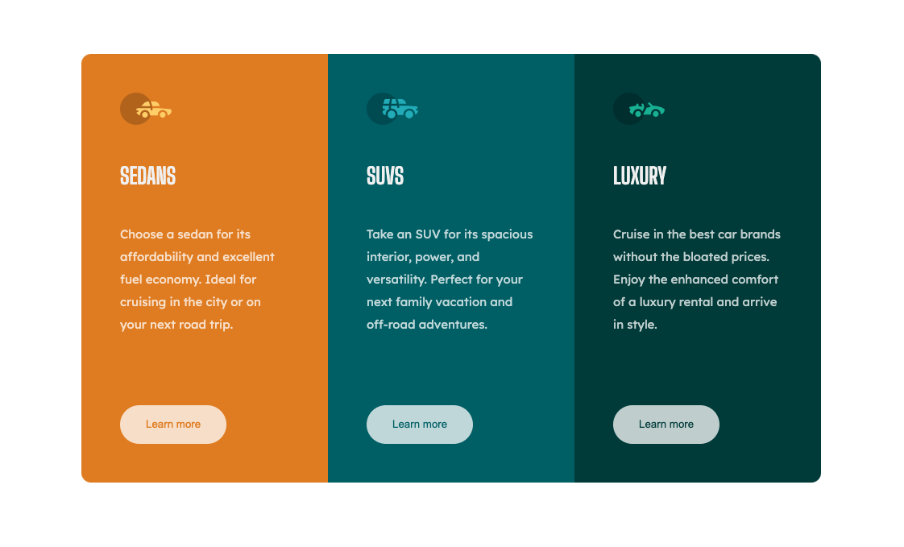

# Frontend Mentor - 3-column preview card component solution

This is a solution to the [3-column preview card component challenge on Frontend Mentor](https://www.frontendmentor.io/challenges/3column-preview-card-component-pH92eAR2-). Frontend Mentor challenges help you improve your coding skills by building realistic projects. 

## Table of contents

- [Overview](#overview)
  - [The challenge](#the-challenge)
  - [Screenshot](#screenshot)
  - [Links](#links)
- [My process](#my-process)
  - [Built with](#built-with)
- [Author](#author)

## Overview

### The challenge

Users should be able to:

- View the optimal layout for the app depending on their device's screen size
- See hover states for all interactive elements on the page
- Calculate the correct tip and total cost of the bill per person

### Screenshot

### Links

- Solution URL: [Add solution URL here](https://github.com/sariodesign/sariodesign.github.io/tree/main/3-column-preview-card-component)
- Live Site URL: [Add live site URL here](https://sariodesign.github.io/3-column-preview-card-component/)

## My process

### Built with

- Semantic HTML5 markup
- CSS custom properties
- Mobile-first workflow

## Author

- Website - [SarioDesign](https://www.sariodesign.dev)
- Frontend Mentor - [@sariodesign](https://www.frontendmentor.io/profile/sariodesign)
- Twitter - [@sariodesign](https://www.twitter.com/sariodesign)
- Linkedin - [@sariodesign](https://www.linkedin.com/in/sariodesign/)
- Github - [@sariodesign](https://github.com/sariodesign)
