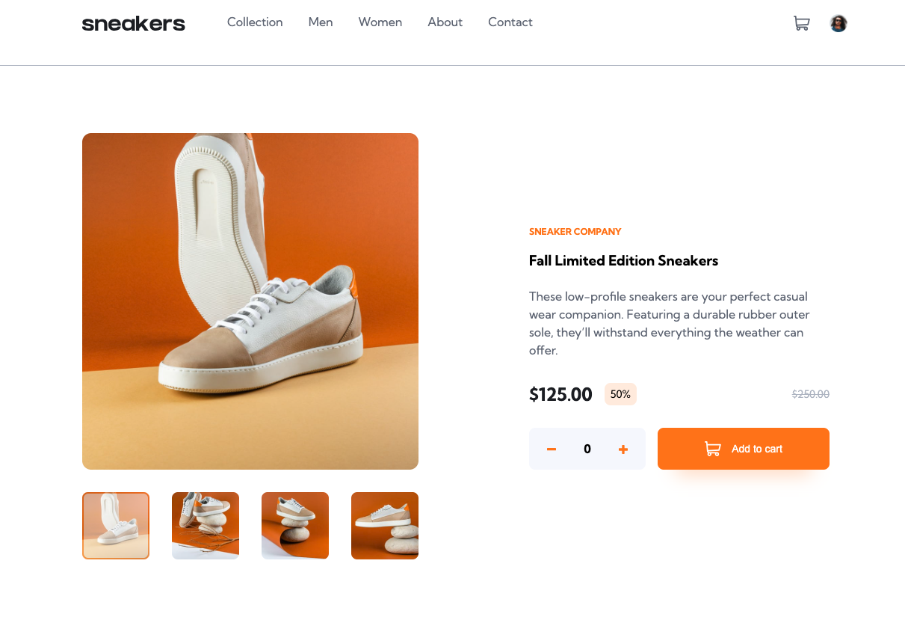

# Frontend Mentor - E-commerce product page solution

This is a solution to the [E-commerce product page challenge on Frontend Mentor](https://www.frontendmentor.io/challenges/ecommerce-product-page-UPsZ9MJp6). Frontend Mentor challenges help you improve your coding skills by building realistic projects.

## Table of contents

- [Overview](#overview)
  - [The challenge](#the-challenge)
  - [Screenshot](#screenshot)
  - [Links](#links)
- [My process](#my-process)
  - [Built with](#built-with)
  - [What I learned](#what-i-learned)
- [Author](#author)

## Overview

### The challenge

Users should be able to:

- View the optimal layout for the site depending on their device's screen size
- See hover states for all interactive elements on the page
- Open a lightbox gallery by clicking on the large product image
- Switch the large product image by clicking on the small thumbnail images
- Add items to the cart
- View the cart and remove items from it

### Screenshot

### Links

- Solution URL: [Github repository](https://github.com/sariodesign/sariodesign.github.io/tree/main/ecommerce-product-page)
- Live Site URL: [Github live app](https://sariodesign.github.io/ecommerce-product-page/dist/)

## My process

### Built with

- Flexbox
- CSS Variables
- Mobile-first workflow
- JS/TS

### What I learned

I improved the knowledges about Typescript, code splitting

## Author

- Website - [SarioDesign](https://www.sariodesign.dev)
- Frontend Mentor - [@sariodesign](https://www.frontendmentor.io/profile/sariodesign)
- Twitter - [@sariodesign](https://www.twitter.com/sariodesign)
- Linkedin - [@sariodesign](https://www.linkedin.com/in/sariodesign/)
- Github - [@sariodesign](https://github.com/sariodesign)
