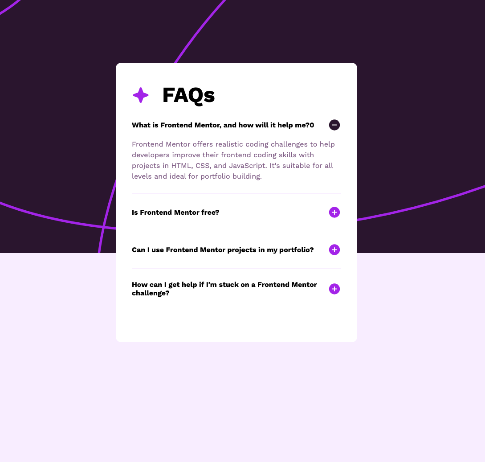

# Frontend Mentor - FAQ accordion

This is a solution to the [FAQ accordion](https://www.frontendmentor.io/challenges/faq-accordion-wyfFdeBwBz/hub). Frontend Mentor challenges help you improve your coding skills by building realistic projects.

## Table of contents

- [Overview](#overview)
  - [The challenge](#the-challenge)
  - [Screenshot](#screenshot)
  - [Links](#links)
- [My process](#my-process)
  - [Built with](#built-with)
  - [What I learned](#what-i-learned)
- [Author](#author)

## Overview

## The challenge

Your challenge is to build out this FAQ accordion and get it looking as close to the design as possible.

You can use any tools you like to help you complete the challenge. So if you've got something you'd like to practice, feel free to give it a go.

Your users should be able to: 

- Hide/Show the answer to a question when the question is clicked
- Navigate the questions and hide/show answers using keyboard navigation alone
- View the optimal layout for the interface depending on their device's screen size
- See hover and focus states for all interactive elements on the page

### Screenshot

### Links

- Solution URL: [Github repository](https://github.com/sariodesign/sariodesign.github.io/tree/main/faq-accordion)
- Live Site URL: [Github live app](https://sariodesign.github.io/faq-accordion/)

## My process

### Built with

- Flexbox
- CSS Variables
- Mobile-first workflow
- Vuejs

### What I learned

I improved the knowledges about keyboard event

## Author

- Website - [SarioDesign](https://www.sariodesign.dev)
- Frontend Mentor - [@sariodesign](https://www.frontendmentor.io/profile/sariodesign)
- Twitter - [@sariodesign](https://www.twitter.com/sariodesign)
- Linkedin - [@sariodesign](https://www.linkedin.com/in/sariodesign/)
- Github - [@sariodesign](https://github.com/sariodesign)
