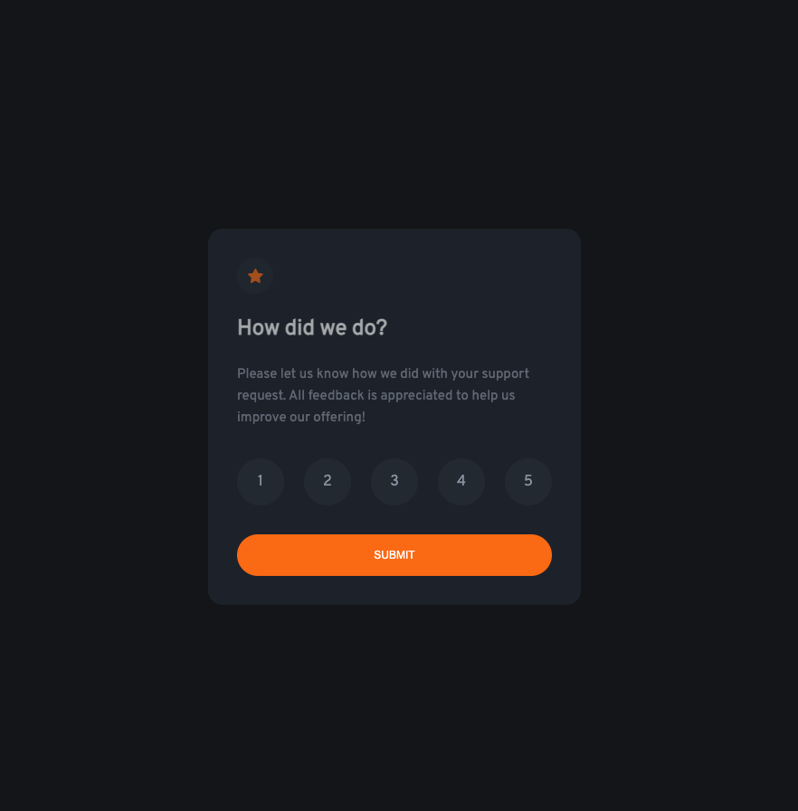

# Frontend Mentor - Interactive rating component solution

This is a solution to the [Interactive rating component challenge on Frontend Mentor](https://www.frontendmentor.io/challenges/interactive-rating-component-koxpeBUmI). Frontend Mentor challenges help you improve your coding skills by building realistic projects. 

## Table of contents

- [Overview](#overview)
  - [The challenge](#the-challenge)
  - [Screenshot](#screenshot)
  - [Links](#links)
- [My process](#my-process)
  - [Built with](#built-with)
  - [What I learned](#what-i-learned)
  - [Continued development](#continued-development)
- [Author](#author)

## Overview

### The challenge

Users should be able to:

- View the optimal layout for the app depending on their device's screen size
- See hover states for all interactive elements on the page
- Select and submit a number rating
- See the "Thank you" card state after submitting a rating

### Screenshot

### Links

- Solution URL: [Github repository](https://github.com/sariodesign/sariodesign.github.io/tree/main/interactive-rating-component)
- Live Site URL: [Vercel live app](https://interactive-rating-component-puce-zeta.vercel.app/)

## My process

### Built with

- Flexbox
- CSS Variables
- Mobile-first workflow
- [React](https://react.dev)
- [Framer Motion](https://www.framer.com/motion/)

### What I learned

I improved the knowledges about React and a Framer Motion

### Continued development

Add some animations

## Author

- Website - [SarioDesign](https://www.sariodesign.dev)
- Frontend Mentor - [@sariodesign](https://www.frontendmentor.io/profile/sariodesign)
- Twitter - [@sariodesign](https://www.twitter.com/sariodesign)
- Linkedin - [@sariodesign](https://www.linkedin.com/in/sariodesign/)
- Github - [@sariodesign](https://github.com/sariodesign)
